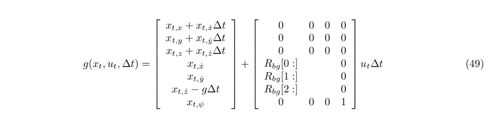
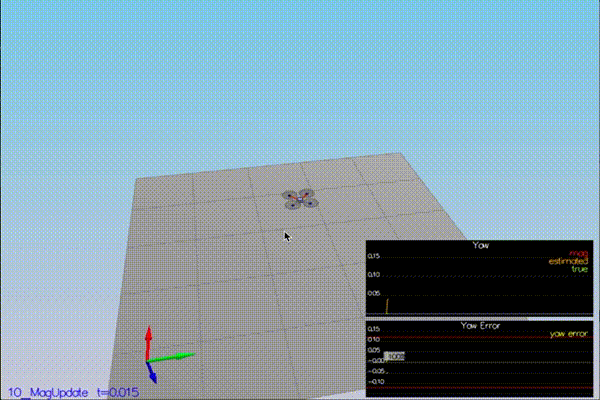

# Writeup

## Step 1 : Sensor noise

The goal was to calculate the standard deviation for the GPS and accelerometer measurements. Then use these standard deviation values to ensure that the simulation succeeds. 

We need to run the simulation for one cycle to collect enough data.

[stddev.py](stddev.py) has the code for calculating the standard deviation. 

**stddev.py output**
```
python stddev.py
MeasuredStdDev_GPSPosXY =  0.7263455847056927
MeasuredStdDev_AccelXY =  0.5102579905374903
```

**Simulation output**

The simulation is successful as seen from the logs below
```
Simulation #3 (../config/06_SensorNoise.txt)
PASS: ABS(Quad.GPS.X-Quad.Pos.X) was less than MeasuredStdDev_GPSPosXY for 68% of the time
PASS: ABS(Quad.IMU.AX-0.000000) was less than MeasuredStdDev_AccelXY for 70% of the time
```

A (high speed) gif of the graph which shows that **most of the data (~70%) falls within the standard deviation**.


A movie at normal speed is here : [output/scenario-1.mov](output/scenario-1.mov)

## Step 2: Attitude Estimation

The goal is to reduce errors in the estimated attitude (Euler angles) by implementing a better rate gyro integration scheme.

We use the non-linear scheme defined in section **7.1.2 Nonlinear Complementary Filter**  of [Estimation for Quadcopters](https://www.overleaf.com/read/vymfngphcccj).

The code between lines [L100-L114](https://github.com/arrawatia/FCND-Estimation-CPP/blob/master/src/QuadEstimatorEKF.cpp#L100-L114) converts the euler angles to quaternions, integrates the gyro measumements and converts the quaternions back to Euler angles. It implements the following equations :
      
**qt** is a quaternion for the euler angles for φ, θ and ψ. 

**dq** is a quaternion that has IMU angular rate measurements in the body frame.


**Simulation output**

Running the simulation with this integration scheme is successful as show in the logs below.
```
PASS: ABS(Quad.Est.E.MaxEuler) was less than 0.100000 for at least 3.000000 seconds
```

A (high speed) gif of the simulation which shows that **errors in estimated attitude is within acceptable limits**.


A movie at normal speed is here : [output/scenario-2.mov](output/scenario-2.mov)

## Step 3: Prediction Step

This step has 2 goals :

1. Implement the state transition function. Then, run Scenario `08_PredictState` to verify that the estimator tracks the actual state with small drift.

2. Add a realistic noisy IMU and implement the `Predict` function. Then, run scenario `09_PredictCovariance` and tune the process noise so that the estimated covariance is similar to actual data.

### Goal 1 : State transition function

The code between lines [L175-L194](https://github.com/arrawatia/FCND-Estimation-CPP/blob/master/src/QuadEstimatorEKF.cpp#L175-L194) implements the **state transition function (g)** to compute the estimated state from current state and control input. 

It implements the equation (49) in section **7.2 Transition Model**  of [Estimation for Quadcopters](https://www.overleaf.com/read/vymfngphcccj).



**Simulation output**

A (high speed) gif of the simulation which shows that **the estimator tracks the actual state with small drift**. 


A movie at normal speed is here : [output/scenario-3.1mov.mov](output/scenario-3.1mov.mov)

### Goal 2 : Add realistic noisy IMU and `Predict` function

We implement the method `GetRbgPrime()` which calculates the partial derivatives of the body-to-global rotation matrix (R). 

The code between lines [L218-L238](https://github.com/arrawatia/FCND-Estimation-CPP/blob/master/src/QuadEstimatorEKF.cpp#L218-L238) implements `GetRbgPrime()` using the equation (52) from section **7.2 Transition Model**  of [Estimation for Quadcopters](https://www.overleaf.com/read/vymfngphcccj). 


We then implement the `Predict` method using the equations (51) and (52) from section **7.2 Transition Model**  of [Estimation for Quadcopters](https://www.overleaf.com/read/vymfngphcccj).


The code between lines [L281-L291](https://github.com/arrawatia/FCND-Estimation-CPP/blob/master/src/QuadEstimatorEKF.cpp#L281-L291) implements the calcuation of `gPrime` in the `Predict()`.

We tune the process noise matrix (Q) to ensure that estimated covariance is similar to actual data. The tuned params are 
```
QVelXYStd = .18
QVelZStd = .1
```

**Simulation output**

A (high speed) gif of the simulation `09_PredictCovariance` which shows that **the estimated covariance tracks the actual data closely**. 


A movie at normal speed is here : [output/scenario-3.2.mov](output/scenario-3.2.mov)

## Step 4: Magnetometer Update

The objective of this step is to add magnetometer information to to improve the vehicle's heading estimation. 

We need to implement `UpdateFromMag()` to add magnetometer readings and to tune `QYawStd` to accurately capture error.

The code between lines [L349-L364](https://github.com/arrawatia/FCND-Estimation-CPP/blob/master/src/QuadEstimatorEKF.cpp#L349-L364) implements the magnetometer update using the measurement model equations (56), (57) and (58) from section **7.3.2 Magnetometer**  of [Estimation for Quadcopters](https://www.overleaf.com/read/vymfngphcccj).


After some tuning, we find that `QYawStd = 0.2` accurately captures the error and successfully completes the scenario as shown in the logs below.

```
PASS: ABS(Quad.Est.E.Yaw) was less than 0.120000 for at least 10.000000 seconds
PASS: ABS(Quad.Est.E.Yaw-0.000000) was less than Quad.Est.S.Yaw for 79% of the time
```

A (high speed) gif of the simulation `10_MagUpdate` which shows that **the estimated standard deviation accurately captures the error and the error is within acceptable bounds**. 



A movie at normal speed is here : [output/scenario-4.mov](output/scenario-4.mov)

## Step 5 : Closed Loop + GPS Update

The goal is add GPS information and replace the ideal estimator and IMU with our estimator.

Changing the following parameters starts using our IMU and estimator instead of the ideal ones.

```
Quad.UseIdealEstimator = 0
#SimIMU.AccelStd = 0,0,0
#SimIMU.GyroStd = 0,0,0
```

The code between lines [L313-L330](https://github.com/arrawatia/FCND-Estimation-CPP/blob/master/src/QuadEstimatorEKF.cpp#L313-L330) implements the GPS update using the measurement model equations (53), (54) and (55) from section **7.3.1 GPS**  of [Estimation for Quadcopters](https://www.overleaf.com/read/vymfngphcccj).


**Simulation output**

The simulation `11_GPSUpdate` completes successfully as you can see from the logs below

```
Simulation #2 (../config/11_GPSUpdate.txt)
PASS: ABS(Quad.Est.E.Pos) was less than 1.000000 for at least 20.000000 seconds
```

A (high speed) gif of  which shows that **position error stays within acceptable bounds**. 


A movie at normal speed is here : [output/scenario-5.mov](output/scenario-5.mov)

## Step 6 : Adding your controller

The goal is to replace the existing controller with the controller implemented in the Controls project. Then, tune the parameters to make sure the scenario `11_GPSUpdate` passes successfully.

The new controller and its parameters are [src/QuadController.cpp](src/QuadController.cpp), [QuadControlParams.txt](QuadControlParams.txt)

**Simulation output**

The simulation `11_GPSUpdate` completes successfully as you can see from the logs below

```Simulation #1 (../config/11_GPSUpdate.txt)
Simulation #2 (../config/11_GPSUpdate.txt)
PASS: ABS(Quad.Est.E.Pos) was less than 1.000000 for at least 20.000000 seconds
```

A (high speed) gif of the simulation which shows that **position error stays within acceptable bounds**. 


A movie at normal speed is here : [output/scenario-6.mov](output/scenario-6.mov)


